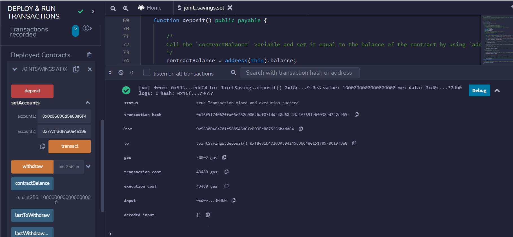
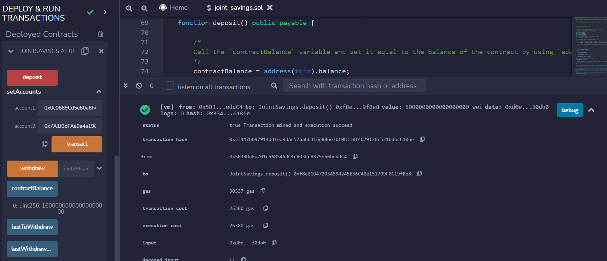
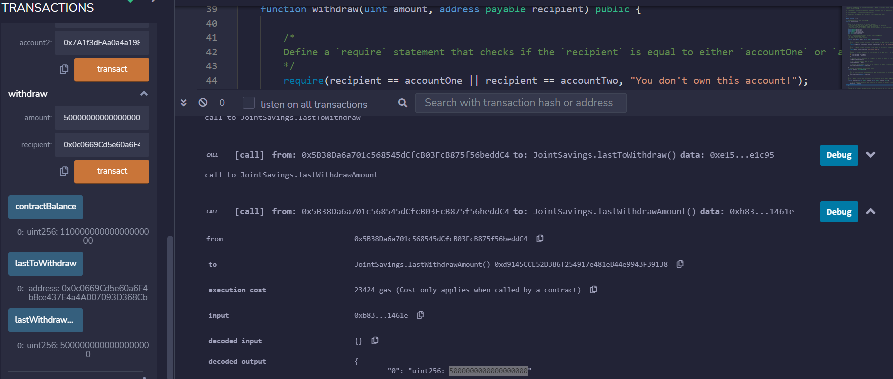

# M20-Solidit_Smart_Contracts


*"Developing a Smart Contract in `Solidity` for a FinTech startup company using the Ethereum-compatible block chain for transactions that connects counterparty financial institutions."* 


## Background 

This fintech startup company has recently hired a team to build smart contracts to automate many of the institutions’ financial processes and features, such as hosting joint savings accounts. The team intends to be the pioneer of the finance industry with its own cross-border, Ethereum-compatible blockchain that connects financial institutions. 

To automate the creation of joint savings accounts, implementation of a Solidity smart contract is constructed that accepts two user addresses. These addresses will be able to control a joint savings account. The smart contract will use ether management functions to implement a financial institution’s requirements for providing the features of the joint savings account. These features will consist of the ability to deposit and withdraw funds from the account. 

---
## Evaluation Results

In the completed Solidity `JointSavings` smart contract a folder named `Execution_Results` contains at least eight images. These images are confirms that the deposit and withdrawal transactions are designed to test the `JointSavings` functionality in the JavaScript VM, worked as expected.

Now that your contract is deployed, it’s time to test its functionality! After each step, capture a screenshot of the execution, and then save it in a folder named `Execution_Results`. You’ll share this folder with your final submission below. 

To interact with your compiled & deployed smart contract, complete the following steps:


1. Use the `setAccounts` function to define the authorized Ethereum address that will be able to withdraw funds from your contract. 

    

2. Test the deposit functionality of your smart contract by sending the following amounts of ether. After each transaction, use the `contractBalance` function to verify that the funds were added to your contract:

- Transaction 1: Send 1 ether as wei 
    

-  

- Transaction 2: Send 10 ether as wei  
 
     

- Transaction 3: Send 5 ether as wei
     


3. Once you’ve successfully deposited funds into your contract, test the contract’s withdrawal functionality by withdrawing 5 ether into `accountOne` and 10 ether into `accountTwo`. After each transaction, use the `contractBalance` function to verify that the funds were withdrawn from your contract. Also, use the `lastToWithdraw` and `lastWithdrawAmount` functions to verify that the address and amount were correct. 

- AccountOne Withdrawal with the `contractBalance` function:

     

- AccountOne Withdrawal with the `lastToWithdraw` and `lastWithdrawAmount` functions: 

    

- AccountTwo Withdrawal with the `contractBalance`, `lastToWithdraw` and `lastWithdrawAmount` functions: 
 
     


---
## Technologies

The software operates on 'python 3.9' with the installation package imports embedded with 'Anaconda3' installation. The application was developed in 'VSCode 1.69.2', using 'Granache 2.5.4' and 'Streamlit v1.10.0'. Below are installation sites and libraries for imported tools to run the program. The application for GUI uses 'Streamlit' to create and run the blockchain transactions, ledgers and validations. 


---

## Installation Guide

Before running the applications open your terminal to install and check for your installations. First navigate to the download instructions using the links below. Then verify if the installations have been completed. 

1. Install Anaconda and create your environment; `python` should be installed with Anaconda:
* [python](https://www.python.org/downloads/) 

2. Verify version in the terminal enter command `python` for information or download:
* [anaconda3](https://docs.anaconda.com/anaconda/install/windows/e) 

3. Install Visual Studio Code, or VS Code, IDE to write the program & run it in Streamlit app: 
* [VSCode](https://code.visualstudio.com/download)

4. Install Ganache to setup a local blockchain to test and develop smart contracts in a local environment.: 
* [Granache](https://trufflesuite.com/ganache/) 

5. Install Streamlit to run the python code for the Blockchain Ledger in a GUI as a shareable web app: 
* [streamlit](https://docs.streamlit.io/library/get-started/installation)


```
python libraries
pip install web3==5.17                          # connects and performs operations on Ethereum-based blockchains
pip install eth-tester==0.5.0b3                 # provides access to the tools to test Ethereum applications
pip install mnemonic                            # generates BIP-39 standard 12 or 24-word mnemonic seed phrases
pip install bip44                               # derives hierarchical deterministic wallets from a seed phrase
```
libraries and modules for crypto_wallet.py:
```
import os                                       # allows extraction of the environment variable `mnemonic`
import requests                                 # allows HTTP requests in order to send response data
from dotenv import load_dotenv
load_dotenv()                                   # loads the `mnemonic` seed phrase in the `eth` environment
from bip44 import Wallet                        # secured storage of private keys in HD wallet for crypto Tx's
from web3 import Account                        # Python function for accessing latest blockchain ledger info
from web3 import middleware                     # manages communication between the program and the Ethereum client
from web3.gas_strategies.time_based import medium_gas_price_strategy          # transaction mined within 5 minutes 
```
libraries and modules for fintech_finder.py: 
```
import streamlit as st                                # Python library for building web interfaces for Python apps 
from dataclasses import dataclass
from typing import Any, List
from web3 import Web3                                 # SDK library that allows communication between Ethereum nodes
w3 = Web3(Web3.HTTPProvider('HTTP://127.0.0.1:7545'))   # connects to Web3 and Mnemonic provider Ganache  blockchain
```

---

## Usage

This application is launched from the VSCode terminal utilizing the above imported Python libraries and tools. The program is developed in VSCode using python language **.py** file to build the `cypto_wallet` and the `fintech_finder` files. `Web3` allows remote procedure call(RPC) to facilitate connection with the `crypto_wallet` and the Ethereum Blockchain network in Granache. The user of the program application operates through the Streamlit web app that provides functionality to create an Ethereum transaction and perform the following: 

### 1. Generate a new Ethereum account instance by using the mnemonic seed phrase provided by Ganache. 
- open up Ganache to create the ethereum block chain environment and add the `mnemonic` seed phrase into the 'Fintech Finder' Application's `.env` text file. 

### 2. Fetch and display the account balance associated with the Ethereum account address. 

- open up the terminal to the project file folder and create the Conda `eth` environment. 
- navigate to the project folder that contains the `.env` file and the `fintech_finder.py` and `crypto_wallet.py` files.
- launch the Streamlit application, type `streamlit run fintech_finder.py` in the terminal. 

### 3. Calculate the total value of an Ethereum transaction, including the gas estimate, that pays a Fintech Finder candidate for their work. 

- on the Streamlit webpage, select a candidate that you would like to hire from the appropriate drop-down menu; then, enter the number of hours you would like to hire them.
- after selecting the candidate with number of hours for hire, the total wage in `ether` is calculated in the Streamlit sidebar below their digital address. 

### 4. Digitally sign a transaction that pays a Fintech Finder candidate, and sends this transaction to the Ganache blockchain.blocks, perform the proof of work consensus protocol, and validate blocks in the chain. 

- click the 'Send Transaction' button to sign and send the transaction with your Ethereum account information. If the transaction is successfully communicated to Ganache, validated, and added to a block, a resulting transaction hash code will be written to the Streamlit application sidebar.

- Navigate to the Ganache menu bar in the upper left to select 'Blocks' and then the 'Tranactions' pages to get transaction details.  

- for additional activity details of Blockchain ledger transaction info, navigate and press the 'Logs' button. 


```
python 
crypto_wallet.py
fintech_finder.py 

```
 

---

## Contributors

*Provided to you by digi-Borg FinTek*, 
Dana Hayes: nydane1@gmail.com


---

## License  

Columbia U. Engineering 
--
[BSD 2-Clause LicenseCopyright (c) 2022, digi-Borg
All rights reserved.](/LICENSE)
