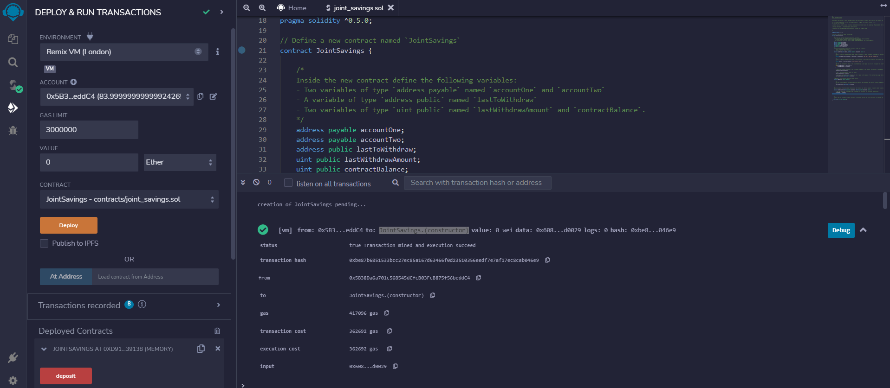
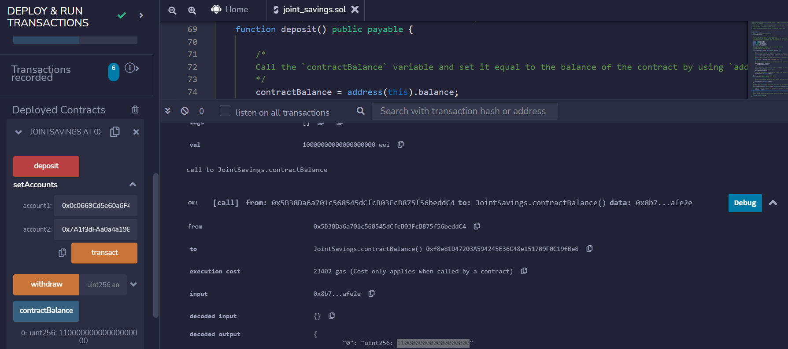
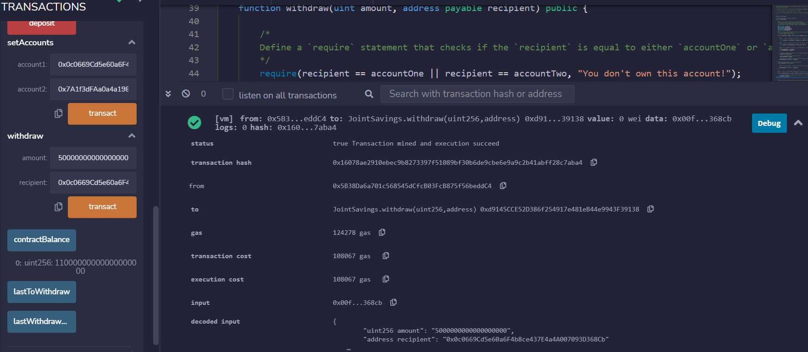

# M20-Solidit_Smart_Contracts


*"Developing a Smart Contract in 'Solidity' for a FinTech startup company using the Ethereum-compatible block chain for transactions that connects counterparty financial institutions."* 


## Background 

This fintech startup company has recently hired a team to build smart contracts to automate many of the institutions’ financial processes and features, such as hosting joint savings accounts. The team intends to be the pioneer of the finance industry with its own cross-border Ethereum-compatible blockchain that connects financial institutions. 

To automate the creation of joint savings accounts, implementation of a Solidity smart contract is constructed that accepts two user addresses. These addresses will be able to control a joint savings account. The smart contract will use ether management functions to implement a financial institution’s requirements for providing the features of the joint savings account. These features will consist of the ability to deposit and withdraw funds from the account.  

---
#
## Evaluation Results

In the completed Solidity JointSavings smart contract a folder named `Execution_Results` contains at least eight images. These images are confirms that the deposit and withdrawal transactions are designed to test the `joint_savings.sol` functionality in the JavaScript VM, as expected.

After deploying the contract, it’s time to test its functionality! After each step, capture a screenshot of the execution, and then save it in a folder named `Execution_Results`. 

To interact with your compiled & deployed smart contract, complete the following steps. 
 

Compiled & Deployed Solidity `JointSavings` smart contract: 



1. Use the `setAccounts` function to define the authorized Ethereum address that will be able to withdraw funds from your contract. 

    

2. Test the deposit functionality of the smart contract by sending the following amounts of ether. After each transaction, use the `contractBalance` function to verify that the funds were added to the contract:

- Transaction 1: Send 1 ether as wei 
    

- Transaction 2: Send 10 ether as wei  
 
     

- Transaction 3: Send 5 ether as wei
     


3. Once successfully depositing funds into the contract, test it’s withdrawal functionality by withdrawing 5 ether into `accountOne` and 10 ether into `accountTwo`. After each transaction, use the `contractBalance` function to verify that the funds were withdrawn from the contract. Also, use the `lastToWithdraw` and `lastWithdrawAmount` functions to verify that the address and amount were correct.  

- AccountOne withdrawal with the `contractBalance` function:

     

- AccountOne withdrawal with the `lastToWithdraw` and `lastWithdrawAmount` functions: 

    

- AccountTwo withdrawal with the `contractBalance`, `lastToWithdraw` and `lastWithdrawAmount` functions: 
 
     


---
#
## Technologies

The software program was built using 'Remix 0.25.1' IDE in a web app. The Remix IDE is an open-source application for developing, deploying, and administering smart contracts that run in Ethereum-based blockchains. The programming language was developed in 'Solidity 0.5.0' to create a smart contract and code that works on the Ethereum blockchain. Once compiled and deployed the code runs in the Ethereum Virtual Machine(EVM) which operates in an isolated decentralized environment mimicking the consensus engine of the Ethereum blockchain. 
 

---

## Installation Guide

The Remix IDE is an open source application for developing, deploying, and administering smart contracts that run in Ethereum-based blockchains. First navigate to use the web version of this IDE, you don’t need to install any software for this module. Open your browser to the [Remix-Docs website](https://remix-ide.readthedocs.io/en/latest/) or use the links below. 


1. [Remix Online IDE](https://remix.ethereum.org) 
* Supported browsers: Firefox, Chrome, Brave. We do not support Remix’s use on tablets or mobile devices. 

2. [Remix Desktop IDE](https://github.com/ethereum/remix-desktop/releases) 

3. Ethereum-Remix a VSCode extension, see [here](https://marketplace.visualstudio.com/items?itemName=RemixProject.ethereum-remix). The documentation for the VSCode extension is located [here](https://marketplace.visualstudio.com/items?itemName=RemixProject.ethereum-remix): 


The following libraries are accessible:
```
[web3 version 1.5.2](https://web3js.readthedocs.io/en/1.0/)
[ethers.js](https://docs.ethers.io/) 
remix 
```
Once compiled, the code runs in the **Ethereum Virtual Machine (EVM)**:

---

## Usage

This application is deployed and run for smart contract transactions to deposit and withdraw `eth` between user accounts in the EthereumVM.  It is launched from the Remix 0.25.1 using Solidity language for the **.sol** file to build the ` joint_savings.sol`. The 'Remix' GUI on the left side of the web page utilizes the program code to run the Smartcontracts Ethereum blockchain transactions. It is deployed in the Remix VM(London) JavaScript Environment utilizing the ‘Solidity’ compiler and tools. 
The user of the program application operates through the Remix IDE website that provides functionality to create an EthereumVM for blockchain transactions and perform the following:  
To interact with your deployed smart contract, select an ‘Account’ to complete the following steps: 

### 1. Compile and Deploy Your Contract in the JavaScript VM. 

1.	In the Remix IDE, navigate to the “Deploy & Run Transactions” pane, and then make sure that “JavaScript VM” is selected as the environment. 

2.	Click the Deploy button to deploy your smart contract, and then confirm that it successfully deployed.
- The terminal can be used to check transactions details and start debugging. 

### 2. Interact with Your Deployed Smart Contract. 

1.	Use the setAccounts function to define the authorized Ethereum address that will be able to withdraw funds from your contract. 

- create new, dummy addresses on the [Vanity-ETH](https://vanity-eth.tk/) website, which includes an Ethereum vanity address generator. 

2.	Test the deposit functionality of the smart contract by sending selected amounts of `ether`. After each transaction, use the `contractBalance` function to verify that the funds were added to your contract: 

- Select 3 different deposit transaction amounts totaling more than 16 `ether` for withdrawals. 

- Reminder that `ether` is counted in `wei` in the contract accounts. (use the website [Ethereum Unit Converter](https://eth-converter.com/) to do the conversion.) 

3.	Once you’ve successfully deposited funds into your contract, test the contract’s withdrawal functionality by withdrawing 5 ether into accountOne and 10 ether into accountTwo. After each transaction, use the `contractBalance` function to verify that the funds were withdrawn from your contract. Also, use the `lastToWithdraw` and `lastWithdrawAmount` functions to verify that the address and amount were correct.


```
Solidity

joint_savings.sol
```
 
---

## Contributors

*Provided to you by digi-Borg FinTek*, 
Dana Hayes: nydane1@gmail.com


---

## License  

Columbia U. Engineering 
--
[BSD 2-Clause LicenseCopyright (c) 2022, digi-Borg
All rights reserved.](/LICENSE)
